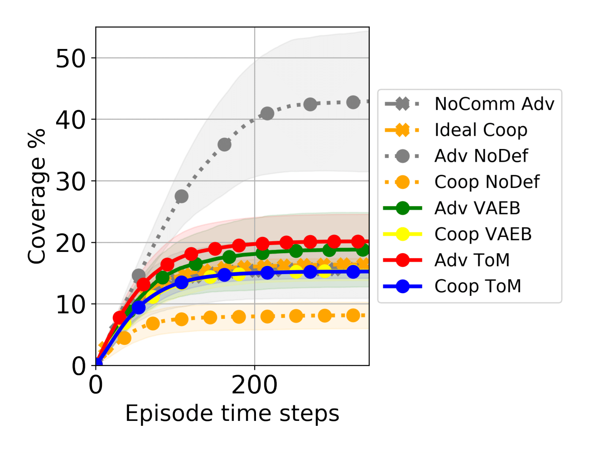
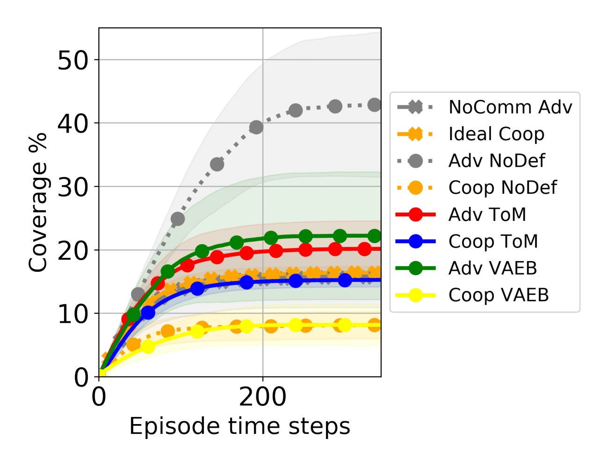

# A Theory-of-Mind Mitigation Against Adversarial Communication
This repository is for the code used in the experimental analysis of [A Theory of Mind Approach as Test-Time Mitigation Against Emergent Adversarial Communication](https://arxiv.org/abs/2302.07176)

## Dependencies:
- Python 3.7.11
- Raylib 1.3.0
- [Adversarial Comm](https://github.com/proroklab/adversarial_comms) Repository
- [Auto Encoding Variational Bayes](https://github.com/angzhifan/Auto-Encoding_Variational_Bayes) Repository

## Pull the original [Adversarial Comms](https://github.com/proroklab/adversarial_comms) Github Pepository from Proroklab.

1. From your terminal, run `git pull https://github.com/proroklab/adversarial_comms.git`
2. Either follow the repo's installation instructions or continue to (3)
3. Run `pip install -r requirements.txt`
4. Run `python setup.py install`
5. We modified `CoverageEnv`'s configuration file, so adjust accordingly to available resources.

## Training in the Standard Coverage Environment
1. Follow the directions from the `adv_comm` repository or continue to (2).
2. Run `python train_policy.py coverage -t 6` to train the cooperative team in the coverage environment for 6 million timesteps with only cooperative agents.
3. Run `python continue_policy.py [cooperative checkpoint path] -t 12 -e coverage -o self_interested` to train the self-interested agent for 6 million timesteps given a fixed cooperative policy.
4. Run `python continue_policy.py [adversarial checkpoint path] -t 18 -e coverage -o re_adapt` to have the cooperative team retrain/perform readaption training in the presence of a fixed adversary policy.
5. Please note the location of where the model parameters are saved, they will be needed for the checkpoint variables.

## Gather the Dataset for the VAEB Defense
1. Open `Generate_Coop_Team_Dataset.py` and replace the directories of where the datasets will be saved and which cooperative model to load in. Then run `python Generate_Coop_Team_Dataset.py`. The cooperative team dataset ends with `_dataset_with_label.pkl`.

## Pull a Variational [Auto-Encoder Bayes](https://github.com/angzhifan/Auto-Encoding_Variational_Bayes) Github Repository for some utilities.
1. Run `git pull https://github.com/angzhifan/Auto-Encoding_Variational_Bayes`. We leverage some helper functions from the repository.

## Train the VAEB model using the dataset collected from the Cooperative Team
1. Open `VAEB_Training.ipynb` and replace all directories with directories pointing to your cooperative team's dataset. Replace the VAEB output path-name e.g. `/vae/vaeb_from_coop_dataset.pth`.

# Parameter Search for Variable Rho
1. Run `python ParameterSearchingRho.py` will evaluate our theory of mind mitigation method with various intervals for the parameter rho. We selected rho based on an analysis plot of return over episodes per fixed interval.

## Evaluate the Baseline and Defenses.

1. Open `Evaluate_VAEB.py` and replace the <b> cooperative team model</b> directory and <b> VAEB model</b> directory with yours. Run `python Evaluate_VAEB.py` which will generated the <b> VAEB baseline for the cooperative team performance before readaption in CoverageEnv </b>.
2. Open `Evaluate_VAEB.py` and replace the <b> readapted cooperative team model directory</b> and <b> VAEB model</b> directory with yours. Run `python Evaluate_VAEB.py` which will generated the <b> VAEB performance for the readapted cooperative team in CoverageEnv </b>.
3. Open `ParameterSearchingRho.py` and comment-in `eval_nocomm_adv(mode=0)` and comment-out the line above it `eval_nocomm_adv(mode=1)`. Replace the <b> cooperative team before readaption directory</b> with yours and the <b> evaluation output directory</b> where you would like to store the evaluation scores. This will generated the ToM defense performance for the cooperative team before readaption training.
3. Open `ParameterSearchingRho.py` and comment-in `eval_nocomm_adv(mode=0)` and comment-out the line above it `eval_nocomm_adv(mode=1)`. Replace the <b> readapted cooperative team directory</b> with yours and the <b> readaption evaluation output directory</b> where you would like to store the evaluation scores. This will generated the ToM defense performance for the readapted cooperative team.
4. To generate the performance baselines: <b> no defense cooperative performance, no adversary communication cooperative performance, ideal cooperative performance, adversary performance with no communication, and adversary performance with no cooperative team defense </b> from the adversarial comm repository, following their evaluation instructions.

# Display the Evaluations and Aggregations
1. Open `PerformanceComparison.ipynb` and replace your evaluation directories for the cooperative team before readaption training for ToM, VAEB and other baselines mentioned in section prior. The first generated graph is the performance comparison prior to readaption training.
2. Open `PerformanceComparison.ipynb` and replace your evaluation directories for the readapted cooperative team before for ToM, VAEB and other baselines mentioned in section prior. The second generated graph is the performance comparison of the defenses given readapted cooperative team.
3. Open `PerformanceComparison.ipynb` and replace the evaluation directories to generate the F1-score, False Positive, False Negative, True Positive and True Negative plot analysis of the ToM defense in comparison to the VAEB.

     

            
     

     

            
     

